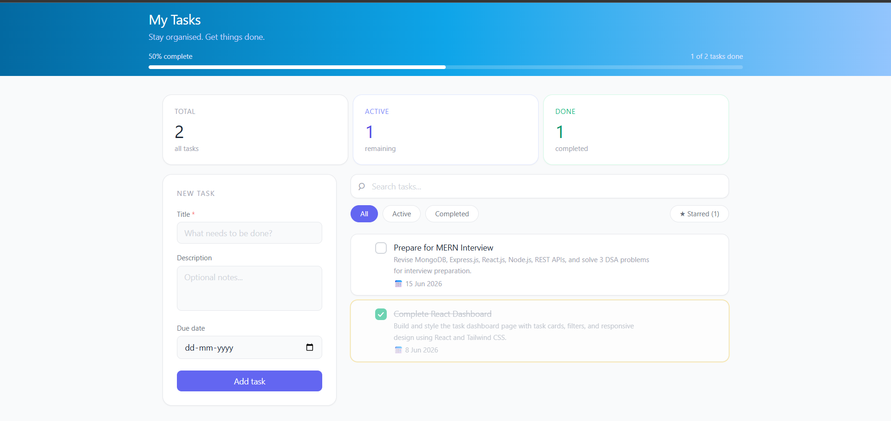

# TaskFlow — Personal Task Manager

A full-stack MERN task manager built as part of a company assignment. Supports creating, editing, deleting, filtering, starring, and drag-and-drop reordering of tasks — with overdue detection and progress tracking.


## Tech Stack

**Frontend**
- React (Vite)
- Tailwind CSS v3
- Native HTML5 Drag and Drop API

**Backend**
- Node.js + Express
- MongoDB Atlas (Mongoose)
- REST API


## Features

- Add tasks with title, description, and due date
- Edit and delete tasks (with confirmation popup)
- Mark tasks as complete / incomplete
- Star tasks to mark them as important
- Filter by All / Active / Completed / Starred
- Search tasks by title
- Overdue detection — highlights tasks past their due date
- "Last day" warning — alerts when a task is due today
- Drag and drop to reorder tasks (order persists after page refresh)
- Progress bar showing completion percentage
- Summary cards showing Total / Active / Done count


## Folder Structure

```
studio/
├── client/                  # React frontend (Vite)
│   ├── src/
│   │   ├── components/
│   │   │   ├── TaskCard.jsx
│   │   │   └── TaskForm.jsx
│   │   ├── App.jsx
│   │   └── index.css
│   ├── tailwind.config.js
│   ├── postcss.config.js
│   └── package.json
│
└── server/                  # Express backend
    ├── controllers/
    │   └── taskController.js
    ├── models/
    │   └── Task.js
    ├── routes/
    │   └── tasks.js
    ├── server.js
    └── .env
```


## Getting Started

### Prerequisites

- Node.js v18+
- MongoDB Atlas account (or local MongoDB)


### 1. Clone the repo

```bash
git clone <your-repo-url>
cd studio
```


### 2. Setup the Backend

```bash
cd server
npm install
```

Create a `.env` file inside `server/`:

```env
PORT=5000
MONGO_URI=your_mongodb_connection_string_here
```

Start the server:

```bash
node server.js
```

You should see:
```
MongoDB connected
Server running on http://localhost:5000
```

### 3. Setup the Frontend

```bash
cd client
npm install
npm run dev
```

App runs at: `http://localhost:5173`


## API Endpoints

| Method | Route | Description |
|--------|-------|-------------|
| GET | `/api/tasks` | Get all tasks (supports `?status=` and `?search=`) |
| POST | `/api/tasks` | Create a new task |
| PUT | `/api/tasks/:id` | Update task (title, description, dueDate, completed, starred) |
| PATCH | `/api/tasks/:id/toggle` | Toggle complete / incomplete |
| DELETE | `/api/tasks/:id` | Delete a task |
| PATCH | `/api/tasks/reorder` | Save drag-and-drop order |


## Environment Variables

| Variable | Description |
|----------|-------------|
| `PORT` | Port for the Express server (default: 5000) |
| `MONGO_URI` | MongoDB connection string (Atlas or local) |


## Screenshots

### TaskFlow Dashboard



## Author

Built by **Rahul** as part of a company hiring assignment.